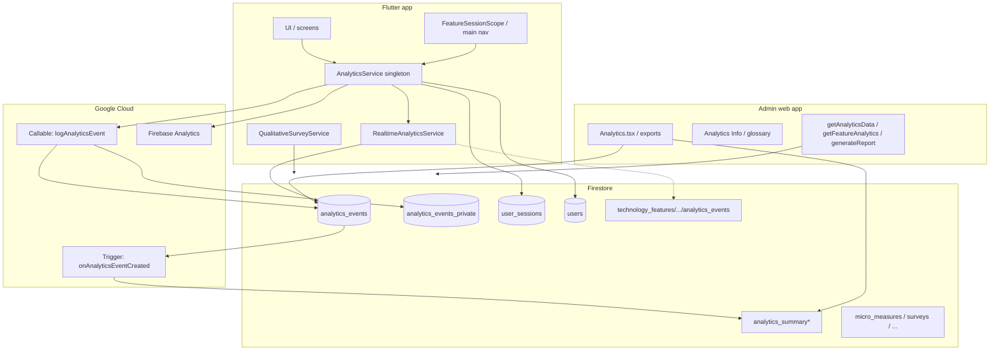

# EmpowerHealth analytical tracking — system overview

This document summarizes **end-to-end** how user behavior is captured, stored, aggregated, and consumed: Flutter client, Cloud Functions, Firestore, Firebase Analytics, and the admin dashboard. It complements the event-level inventory in [`mobile-analytics-inventory.md`](mobile-analytics-inventory.md) and the mobile pipeline details in [`realtime-analytics.md`](realtime-analytics.md).

---

## 1. Purpose and design principles

- **Research-ready cohort context**: Events carry pregnancy and navigation context (e.g. cohort, trimester, gestational week, navigator vs self-directed) where the profile supplies it.
- **Defense in depth**: The client never blocks UX on analytics; failures are logged and dropped or retried according to rules.
- **Dual visibility**: Custom Firestore data powers admin tooling and exports; **Google Analytics for Firebase** receives a parallel stream for standard dashboards.
- **Aggregation without double-counting**: The same logical event can touch the callable path and the mobile Firestore path; the server-side trigger **only aggregates mobile-originated** `analytics_events` rows.

---

## 2. High-level architecture

**Reading the diagram**

- Most instrumented actions flow through **`AnalyticsService`**. Qualitative survey *storage* still uses `QualitativeSurveyService`; learning-module survey *analytics* also calls `AnalyticsService` after a successful qualitative submit when `feature` is `learning-modules`.
- **`logAnalyticsEvent`** writes **anonymous** + **private** rows; those CF rows are tagged `source: cloud_function`.
- After a successful callable, **`RealtimeAnalyticsService`** writes **`source: mobile`** rows used for **dashboard rollups**.
- **`onAnalyticsEventCreated`** updates **`analytics_summary/global`**, daily, hourly, and per-feature summaries **only** for `source: mobile`.

---

## 3. Client: `AnalyticsService` (`lib/services/analytics_service.dart`)

### 3.1 Responsibilities

| Responsibility | Notes |
| --- | --- |
| **Auth gating & queue** | Events are queued until Firebase Auth is ready, then flushed (retries capped). |
| **Callable invoke** | `httpsCallable('logAnalyticsEvent')` in region **`us-central1`**, with refreshed ID token. |
| **Lifecycle metadata** | `getUserLifecycleContext` merges profile-derived fields into every payload. |
| **Session id** | In-memory `session_*` id attached to callable payload and mobile writes. |
| **`user_sessions`** | `startSession` / `endSession` persist start/end and **duration seconds** on `user_sessions/{sessionId}`. |
| **Mobile Firestore mirror** | On successful send, `_saveEventToFirestore` → `RealtimeAnalyticsService.writeMobileAnalyticsEvent`. |
| **Firebase Analytics** | `_logToFirebaseAnalytics` maps names/parameters to GA4 constraints (length limits, primitive types). |
| **Specialized stores** | Surveys and outcomes may also write `micro_measures`, `helpfulness_surveys`, `milestone_checkins`, `care_navigation_outcomes` (see §8). |

### 3.2 Session lifecycle (app)

| Phase | Mechanism | Events / data |
| --- | --- | --- |
| Cold start (signed in) | After `waitForInitialAuthResolution()`, `_trackSessionStart` | `session_started` with `entry_point: app_cold_start`; `user_sessions` doc created |
| Background | `AppLifecycleState.paused` in `_AuthWrapperState` | `session_ended` with duration; `user_sessions` updated; in-memory session cleared after the event |
| Resume | `resumed` only if previous state was `paused` | New `session_started` with `entry_point: app_resume` |
| Teardown | `dispose` of auth wrapper | Best-effort `session_ended` |

`logSessionEnded` calls `endSession()` first (so duration and `user_sessions` are correct), then emits `session_ended` with the **same** `sessionId`, then clears session state.

### 3.3 Feature lifecycle

- **`feature_session_started` / `feature_session_ended`** bracket time in a feature surface (metadata: `entry_source`, `duration_seconds` on end).
- **Main tab bar** emits these when switching tabs (e.g. `entry_source: main_tab`).
- **`FeatureSessionScope`** (ref-counted widget) wraps deep flows so nested routes share **one** logical feature session (auth, provider search, visit summary upload, birth plan, care survey, etc.).

### 3.4 Naming and allowlist

Backend validation (callable) accepts these **`feature`** values:  
`provider-search`, `authentication-onboarding`, `user-feedback`, `appointment-summarizing`, `journal`, `learning-modules`, `birth-plan-generator`, `community`, `profile-editing`, `app`.  
Constants live in `lib/services/analytics/realtime_analytics_config.dart`.

### 3.5 Notable product events (recent additions)

| Event | Feature id | Meaning |
| --- | --- | --- |
| `provider_review_submitted` | `provider-search` | User submitted a provider review (after successful save). |
| `visit_summary_viewed` | `appointment-summarizing` | User opened an existing visit/appointment summary from the list (`summary_id`). |
| `learning_module_survey_submitted` | `learning-modules` | Surveys only (no quizzes). `survey_context`: `qualitative_feedback` (module detail dialog) or `module_archive_gate` (pre-archive dialog). |
| `birth_plan_viewed` | `birth-plan-generator` | User opened the saved plan display screen. |
| `birth_plan_exported` | `birth-plan-generator` | User invoked share/export via system sheet from display screen; `export_type`: `pdf_share` or `text_share`. |

---

## 4. Cloud Function: `logAnalyticsEvent` (`admindash/functions/src/index.ts`)

- **Auth**: Requires Firebase Auth (`request.auth`); **App Check** is explicitly **not** enforced (`enforceAppCheck: false`) so clients without App Check can still log.
- **Anonymization**: Builds `anonUserId` from UID + configurable salt (`ANALYTICS_SALT`).
- **Writes**:
  - **`analytics_events`**: anonymized row with `source: 'cloud_function'`, `aggregationVersion: 1` — **not** counted by the aggregation trigger.
  - **`analytics_events_private`**: same payload plus **`uid`** for admin-only research.

Invalid or unknown `feature` values are warned and may be coerced (implementation in function).

---

## 5. Mobile realtime row: `RealtimeAnalyticsService` (`lib/services/analytics/realtime_analytics_service.dart`)

For each successful analytics send, the client adds a **second** document to `analytics_events` with:

- `source: 'mobile'`, `aggregationVersion: 1`
- `userId`, `anonUserId`, `sessionId`, `feature`, `eventName`
- `clientTimestamp`, server `timestamp`, `platform`, `environment` (`local` vs `prod`), `appVersion`
- **`dateKey` / `hourKey` / `monthKey`** (UTC) for cheap rollups
- **`metadata`**: sanitized (no cycles; lists capped) lifecycle + parameters
- Optional top-level duplicates: `cohortType`, `gestationalWeek`, `trimester` from metadata

**Technology dossier mirror**: When `feature` maps to a `technology_features` doc id, the same payload is copied to  
`technology_features/{featureId}/analytics_events` (best-effort).

---

## 6. Aggregation: `onAnalyticsEventCreated` (`admindash/functions/src/analyticsAggregation.ts`)

- **Trigger**: `onDocumentCreated` on `analytics_events/{eventId}` (region **`us-central1`**).
- **Skip** if `data.source === 'cloud_function'` — prevents double-counting when both CF and client wrote for the same user action.
- **Updates** (batched merges):
  - `analytics_summary/global` — `totalEvents`, `lastEventName`, plus **first-class “today*” counters** for selected event names (posts, journal, visit summaries, birth plans, provider searches, sessions started, screen views, profile updates, sign-ins, etc.).
  - `analytics_summary_daily/{dateKey}` — `countsByEventName`, `countsByFeature`, plus mapped daily fields.
  - `analytics_summary_hourly/{hourKey}` — hourly event name counts.
  - `analytics_feature_summary/{featureDocId}` — per-feature totals and `countsByEventName`.

Clients **cannot** write summary documents; only Functions (Admin SDK) do.

---

## 7. Firestore collections (analytics-related)

| Collection | Who writes | Purpose |
| --- | --- | --- |
| `analytics_events` | CF + mobile client | Raw events; CF rows anonymized; mobile rows full schema + UID |
| `analytics_events_private` | CF only | UID for admin-only queries |
| `analytics_summary/*` | Trigger only | Pre-aggregated dashboard metrics |
| `user_sessions` | Mobile `AnalyticsService` | Session boundaries and duration |
| `users` | Mobile (merge) | Lightweight analytics context updates |
| `technology_features/{id}/analytics_events` | Mobile | Per-feature event stream for dossiers |
| `micro_measures`, `helpfulness_surveys`, `milestone_checkins`, … | Mobile via dedicated helpers | Structured survey / outcome data beyond generic events |

**Qualitative surveys**: `QualitativeSurveyService` writes under `technology_features/{featureId}/qualitative_surveys` and does **not** go through `logAnalyticsEvent` (see inventory).

---

## 8. Firebase Analytics (GA4)

- Invoked for the same **event names** as custom analytics (with truncation and type coercion).
- Useful for funnels and platform-native reporting; **not** the source for Firestore aggregation.

---

## 9. Admin dashboard

| Surface | Role |
| --- | --- |
| **`Analytics.tsx`** | Charts, filters, CSV export; reads **`analytics_events`** (range queries) and **summary** collections via helpers like `analyticsDashboardFirestore.ts`. The **Outcome Signals** chart aggregates **`technology_features/{featureId}/qualitative_surveys`** (parallel per-feature queries, not a collection group), **`ModuleFeedback`**, and **`CareSurvey`** into Monday-start weekly **1–5** averages (see `admindash/FEATURES.md` §10). |
| **`getAnalyticsData` (callable)** | Server-side aggregation over `analytics_events` or `analytics_events_private`, holistic report fields, date ranges — requires auth; unanonymized data restricted to admins. |
| **`/analytics/info`** | Human-readable glossary: per-feature **lifecycle start → actions → lifecycle end**, with implementation status (`Tracked` / `Partial` / `Needs Implementation`). |
| **Technology Overview** | Can surface feature-linked metadata and change history; not the primary analytics datastore. |

Export CSV typically includes: `eventName`, `feature`, duration, `timestamp`, `source`.

---

## 10. Security (summary)

- **`analytics_events`**: Authenticated users may create rows tied to their UID (see `firestore.rules`); admins read broadly.
- **`analytics_summary*`** / build metadata: **no client writes**; admin read where configured.
- Callable functions use **`request.auth`** for Gen-2 compatibility.

---

## 11. Local development

- **Firestore emulator**: `--dart-define=USE_FIREBASE_EMULATOR=true` (see `realtime-analytics.md`).
- **Important**: For full isolation, point **Functions** emulator at the same project; otherwise callable logs may still hit production.

---

## 12. Related documentation

| Document | Contents |
| --- | --- |
| [`mobile-analytics-inventory.md`](mobile-analytics-inventory.md) | Event-by-event inventory, gaps, wiring notes |
| [`realtime-analytics.md`](realtime-analytics.md) | Mobile schema, summary collections, emulator |
| [`analytics-implementation-report.md`](analytics-implementation-report.md) | Implementation audit threads |
| [`admindash/FEATURES.md`](../admindash/FEATURES.md) §10 | Product-facing “how analytics works” + change history |

---

## 13. Key source files (quick reference)

| Area | Path |
| --- | --- |
| Client orchestration | `lib/services/analytics_service.dart` |
| Mobile Firestore writer | `lib/services/analytics/realtime_analytics_service.dart` |
| Event / feature constants | `lib/services/analytics/realtime_analytics_config.dart` |
| App session lifecycle | `lib/main.dart` (`_AuthWrapperState`) |
| Tab + navigation instrumentation | `lib/cors/main_navigation_scaffold.dart` |
| Feature session widget | `lib/widgets/feature_session_scope.dart` |
| Callable + other functions | `admindash/functions/src/index.ts` |
| Aggregation trigger | `admindash/functions/src/analyticsAggregation.ts` |
| Admin Firestore readers | `admindash/src/lib/analyticsDashboardFirestore.ts` |
| Admin analytics UI | `admindash/src/app/pages/Analytics.tsx`, `AnalyticsInfo.tsx` |

---

*Last updated: 2026-03-24 — includes admin Outcome Signals chart (survey-backed weekly aggregates) and admin Analytics Info layout.*
