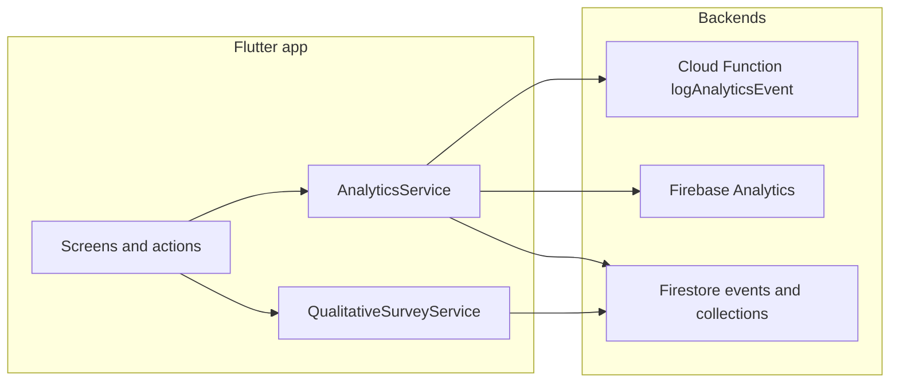

# Mobile app analytics inventory

This document catalogs plausible **user actions** in the EmpowerHealth Flutter app, groups them by **feature category** (aligned with backend validation and admin feature IDs), maps what is **already instrumented**, and records **gaps**—especially **time on screen / session duration**—that explain uneven analytics behavior.

It is an **inventory and gap analysis**, not an implementation checklist. For admin-side feature metadata and KPI wiring, see [`admindash/src/lib/features.ts`](../admindash/src/lib/features.ts) and Firestore `technology_features`.

---

## How analytics work in this app

| Layer | Role |
| --- | --- |
| [`lib/services/analytics_service.dart`](../lib/services/analytics_service.dart) | Singleton: queues events until auth is ready; sends to Cloud Function; mirrors to Firebase Analytics; updates Firestore `users` / `user_sessions`; writes optional collections (`micro_measures`, `helpfulness_surveys`, `milestone_checkins`, `care_navigation_outcomes`). |
| Cloud Function `logAnalyticsEvent` | Region `us-central1`; validates `feature` against an allowlist; expects authenticated user. |
| [`lib/services/qualitative_survey_service.dart`](../lib/services/qualitative_survey_service.dart) | Separate path: writes qualitative surveys under `technology_features/{featureId}/qualitative_surveys`. Uses `AnalyticsService().getSessionId()` only; **does not** call `logEvent`. |

**Backend `feature` allowlist** (must match event payloads):  
`provider-search`, `authentication-onboarding`, `user-feedback`, `appointment-summarizing`, `journal`, `learning-modules`, `birth-plan-generator`, `community`, `profile-editing`, `app`.

There is **no** `FirebaseAnalyticsObserver` on `MaterialApp`—**screen tracking is manual** via `logScreenView` (`eventName: screen_view`).

---

## Cross-cutting behavior

### Session lifecycle

| Event / data | Behavior |
| --- | --- |
| `session_started` | Logged from [`lib/main.dart`](../lib/main.dart) after `waitForInitialAuthResolution()`, with user profile. Also creates/merges a `user_sessions/{sessionId}` document via `startSession()`. |
| `session_ended` | **`logSessionEnded` / `endSession()` are not called from any `lib/` screen**—sessions may never receive `endedAt` or `durationSeconds` in Firestore. `logSessionEnded` exists on `AnalyticsService` only. |

### Screen views (`screen_view`)

- Emitted from [`lib/cors/main_navigation_scaffold.dart`](../lib/cors/main_navigation_scaffold.dart): initial load and each tab change — `screen_name`: `main_navigation` (first), then `home`, `learn`, `journal`, `community`, `profile`.
- **`logScreenView` does not pass `feature`**—these events use `feature: app` (default in `logScreenView`).

### Other surfaces

- Individual feature screens often pass a **feature-specific** `screenName` string (see per-category tables) but still omit the explicit `feature` parameter unless noted.

### Notifications

- `logNotificationOpened` and `logNotificationReceived` are **defined** on `AnalyticsService` but **not referenced** elsewhere under `lib/`.

### Dwell time and duration

- **Global session duration** in `user_sessions` is unreliable without `endSession`.
- **Per-feature duration** is only partially modeled: e.g. `logLearningModuleCompleted` accepts `timeSpentSeconds`, and `logVisitSummaryCreated` accepts `timeToComplete`, `logBirthPlanCompleted` accepts `completionTime`—but **call sites must supply** these values.
- **Learning module detail** sets `_viewStartTime` in [`learning_module_detail_screen.dart`](../lib/Home/Learning%20Modules/learning_module_detail_screen.dart) but **does not** compute duration or call `logLearningModuleCompleted` on exit.

---

## Files that call `AnalyticsService` (excluding the service itself)

| File | Role |
| --- | --- |
| [`lib/main.dart`](../lib/main.dart) | `waitForInitialAuthResolution`, `logSessionStarted` |
| [`lib/cors/main_navigation_scaffold.dart`](../lib/cors/main_navigation_scaffold.dart) | `logScreenView` / tab names |
| [`lib/providers/provider_search_entry_screen.dart`](../lib/providers/provider_search_entry_screen.dart) | `logScreenView`, `logProviderSearchInitiated` |
| [`lib/providers/provider_search_results_screen.dart`](../lib/providers/provider_search_results_screen.dart) | `logScreenView`, `logProviderProfileViewed` (tap result) |
| [`lib/providers/provider_profile_screen.dart`](../lib/providers/provider_profile_screen.dart) | `logProviderProfileViewed`, `logScreenView`, `logProviderContactClicked` |
| [`lib/learning/learning_modules_screen.dart`](../lib/learning/learning_modules_screen.dart) | `logScreenView` (legacy route; main shell uses v2) |
| [`lib/Home/Learning Modules/learning_module_detail_screen.dart`](../lib/Home/Learning%20Modules/learning_module_detail_screen.dart) | `logLearningModuleViewed`, `logLearningModuleStarted`, `logLearningModuleQuizSubmitted`, `logConfidenceSignalSubmitted` |
| [`lib/appointments/upload_visit_summary_screen.dart`](../lib/appointments/upload_visit_summary_screen.dart) | `logScreenView`, `logVisitSummaryCreated` |
| [`lib/birthplan/comprehensive_birth_plan_screen.dart`](../lib/birthplan/comprehensive_birth_plan_screen.dart) | `logScreenView`, `logBirthPlanCompleted` |
| [`lib/Journal/Journal_screen.dart`](../lib/Journal/Journal_screen.dart) | `logScreenView`, `logJournalEntryCreated`, `logJournalMoodSelected` |
| [`lib/Community/community_screen.dart`](../lib/Community/community_screen.dart) | `logScreenView` |
| [`lib/Community/create_post_screen.dart`](../lib/Community/create_post_screen.dart) | `logCommunityPostCreated` |

[`lib/services/qualitative_survey_service.dart`](../lib/services/qualitative_survey_service.dart) uses `AnalyticsService().getSessionId()` only.

---

## Feature categories (aligned with backend IDs)

### `app`

**User action surfaces**

- App launch, cold start, return from background (no dedicated events).
- Main tab shell: Home, Learn, Journal, Community, Profile ([`main_navigation_scaffold.dart`](../lib/cors/main_navigation_scaffold.dart)).
- Deep links / named routes ([`app_router.dart`](../lib/app_router.dart)).

**Already instrumented**

- `session_started` (with profile context) — [`main.dart`](../lib/main.dart).
- `screen_view` with `screen_name` `main_navigation`, `home`, `learn`, `journal`, `community`, `profile` — [`main_navigation_scaffold.dart`](../lib/cors/main_navigation_scaffold.dart).

**Gaps and duration**

- No `session_ended`; session documents may lack `endedAt` / `durationSeconds`.
- No notification open/receive tracking despite API support.
- Tab `screen_view` events are categorized under `feature: app`, not the feature implied by the tab name.

---

### `authentication-onboarding`

**User action surfaces**

- Sign in, sign up, password reset, terms — [`auth/auth_screen.dart`](../lib/auth/auth_screen.dart), [`Login_screen.dart`](../lib/auth/Login_screen.dart), [`Sign_up_screen.dart`](../lib/auth/Sign_up_screen.dart), [`terms_and_conditions_screen.dart`](../lib/auth/terms_and_conditions_screen.dart).
- Profile creation — [`profile/profile_creation_screen.dart`](../lib/profile/profile_creation_screen.dart).
- Consent / first-run — [`privacy/consent_screen.dart`](../lib/privacy/consent_screen.dart).

**Already instrumented**

- None directly — no `AnalyticsService` calls in `auth/` or profile creation paths in this repo snapshot.

**Gaps and duration**

- No events for login success/failure, signup complete, onboarding step completion, or time to complete profile/consent.
- First authenticated session is partially covered by global `session_started` only.

---

### `profile-editing`

**User action surfaces**

- Edit profile tab ([`editprofile/edit_profile_screen.dart`](../lib/editprofile/edit_profile_screen.dart)): name, email, preferences, pregnancy fields, photo, save/cancel.
- Privacy center — [`privacy/privacy_center_screen.dart`](../lib/privacy/privacy_center_screen.dart).

**Already instrumented**

- None — no `AnalyticsService` in `editprofile/` or `privacy/` (aside from consent flow).

**Gaps and duration**

- No `screen_view` on profile edit; no save/update events; no time-on-profile metrics.

---

### `provider-search`

**User action surfaces**

- Provider hub / search entry — [`provider_search_screen.dart`](../lib/providers/provider_search_screen.dart), [`provider_search_entry_screen.dart`](../lib/providers/provider_search_entry_screen.dart).
- Search execution, filters, radius, insurance — entry + [`provider_search_results_screen.dart`](../lib/providers/provider_search_results_screen.dart).
- Provider profile — [`provider_profile_screen.dart`](../lib/providers/provider_profile_screen.dart).
- Reviews — [`provider_review_screen.dart`](../lib/providers/provider_review_screen.dart).
- Add/save provider — [`add_provider_screen.dart`](../lib/providers/add_provider_screen.dart).

**Already instrumented**

- `screen_view` with `screen_name` `provider_search` (entry), `provider_search_results`, `provider_profile` (see each file for exact strings).
- `provider_search_initiated` — parameters such as radius, insurance, provider type, telehealth, accepting new patients — [`provider_search_entry_screen.dart`](../lib/providers/provider_search_entry_screen.dart).
- `provider_profile_viewed` — from **results** (`provider_search_results_screen`) and again on **profile open** (`provider_profile_screen`) — possible duplicate per navigation.
- `provider_contact_clicked` — phone, website, address taps as implemented — [`provider_profile_screen.dart`](../lib/providers/provider_profile_screen.dart).

**Gaps and duration**

- `logProviderFilterApplied`, `logProviderSaved`, `logProviderReviewViewed` — **defined in `AnalyticsService`, no UI callers found**.
- No dwell time on results list or profile; no time-to-first-click.

---

### `learning-modules`

**User action surfaces**

- Learning hub list — [`learning_modules_screen_v2.dart`](../lib/Home/Learning%20Modules/learning_modules_screen_v2.dart) (primary tab content).
- Module detail (content, notes, quiz, qualitative feedback) — [`learning_module_detail_screen.dart`](../lib/Home/Learning%20Modules/learning_module_detail_screen.dart).
- Legacy: [`learning/learning_modules_screen.dart`](../lib/learning/learning_modules_screen.dart), [`learning/module_detail_screen.dart`](../lib/learning/module_detail_screen.dart) (if still reachable).
- Home cards opening `LearningModuleDetailScreen` without `moduleId` — [`home_screen_v2.dart`](../lib/Home/home_screen_v2.dart) (fallback `unknown`).

**Already instrumented**

- `learning_module_viewed`, `learning_module_started` — detail screen.
- `learning_module_quiz_submitted` — quiz.
- `logConfidenceSignalSubmitted` — micro-measure path (also writes `micro_measures` + `micro_measure_submitted` event).
- `screen_view` — legacy `learning_modules_screen.dart` only; **v2 list has no direct `AnalyticsService` calls** — tab `learn` is the main signal.

**Gaps and duration**

- `logLearningModuleCompleted`, `logLearningModuleVideoPlayed`, `logLearningModuleVideoCompleted` — **not called** from `lib/`.
- `_viewStartTime` unused for duration; no exit completion event.
- `logHelpfulnessSurveySubmitted` — **not wired** from module UI (helpfulness helpers exist on service).

---

### `appointment-summarizing`

**User action surfaces**

- Upload / create visit summary — [`appointments/upload_visit_summary_screen.dart`](../lib/appointments/upload_visit_summary_screen.dart).
- View/list summaries — [`visits/visit_summary_screen.dart`](../lib/visits/visit_summary_screen.dart), [`Home/visit_summary_screen.dart`](../lib/Home/visit_summary_screen.dart), [`appointments/appointments_screen.dart`](../lib/Home/Appointments/appointments_screen.dart).

**Already instrumented**

- `screen_view` — upload screen.
- `visit_summary_created` — on successful create (with optional `timeToComplete` if passed at call site).

**Gaps and duration**

- `logVisitSummaryEdited`, `logVisitSummaryExportedPdf`, `logVisitSummarySharedProvider`, `logVisitSummaryVoiceNoteAdded` — **defined, not called** from `lib/`.
- No dwell time on read-only summary views.

---

### `birth-plan-generator`

**User action surfaces**

- Birth plans list — [`birthplan/birth_plans_list_screen.dart`](../lib/birthplan/birth_plans_list_screen.dart).
- Comprehensive builder — [`birthplan/comprehensive_birth_plan_screen.dart`](../lib/birthplan/comprehensive_birth_plan_screen.dart).
- Other flows: [`birth_plan_creator_screen.dart`](../lib/birthplan/birth_plan_creator_screen.dart), [`birth_plan_display_screen.dart`](../lib/birthplan/birth_plan_display_screen.dart), [`Home/birth_plan_creator_screen.dart`](../lib/Home/birth_plan_creator_screen.dart).

**Already instrumented**

- `screen_view` — comprehensive screen.
- `birth_plan_completed` — on completion.

**Gaps and duration**

- `logBirthPlanStarted`, `logBirthPlanTemplateSelected`, `logBirthPlanUpdated`, `logBirthPlanSharedProvider`, `logBirthPlanDownloadedPdf` — **defined, not called** from `lib/`.
- `completionTime` / `sectionsCompleted` only useful if the caller passes them — verify at call site for consistency.

---

### `journal`

**User action surfaces**

- Journal list / entries — [`Journal/Journal_screen.dart`](../lib/Journal/Journal_screen.dart).
- Entry compose/edit — [`Journal/Journal_entry_screen.dart`](../lib/Journal/Journal_entry_screen.dart).

**Already instrumented**

- `screen_view` — journal.
- `journal_entry_created`, `journal_mood_selected` — journal screen flows.

**Gaps and duration**

- `logJournalEntryUpdated`, `logJournalEntryDeleted`, `logJournalEntryShared` — **defined, not called** from `lib/`.
- No dwell time per session.

---

### `community`

**User action surfaces**

- Forum list — [`Community/community_screen.dart`](../lib/Community/community_screen.dart); survey banner [`widgets/community_survey_banner.dart`](../lib/widgets/community_survey_banner.dart).
- Create post — [`Community/create_post_screen.dart`](../lib/Community/create_post_screen.dart).
- Thread / post detail — [`Community/post_detail_screen.dart`](../lib/Community/post_detail_screen.dart), [`forum_detail_screen.dart`](../lib/Community/forum_detail_screen.dart).
- Qualitative survey dialog — [`widgets/qualitative_survey_dialog.dart`](../lib/widgets/qualitative_survey_dialog.dart) → Firestore via `QualitativeSurveyService` (not `logEvent`).

**Already instrumented**

- `screen_view` — community.
- `community_post_created` — create post success.

**Gaps and duration**

- `logCommunityPostViewed`, `logCommunityReplyCreated`, `logCommunityPostLiked`, `logCommunityPostReported`, `logCommunitySupportRequest` — **defined, not called** from `lib/`.
- Qualitative surveys: **parallel storage** under `technology_features`; feature-level analytics events not duplicated in `AnalyticsService` stream.

---

### `user-feedback`

**User action surfaces**

- Care check-in / milestone-style flows — [`care_survey/care_navigation_survey_screen.dart`](../lib/care_survey/care_navigation_survey_screen.dart) (and any in-app surveys).
- Confidence / helpfulness / milestone APIs on `AnalyticsService`.

**Already instrumented**

- `logConfidenceSignalSubmitted` — from learning module detail (cross-feature: `user-feedback` + learning content).
- `logMilestoneCheckinSubmitted`, `logHelpfulnessSurveySubmitted` — **wrappers exist**; **no UI callers** found for `logMilestoneCheckinSubmitted` / `logHelpfulnessSurveySubmitted` in `lib/` grep.
- `saveCareNavigationOutcome` — **no UI callers** found under `lib/care_survey/`.

**Gaps and duration**

- Care navigation survey screen does not surface analytics helpers in this snapshot.
- Qualitative surveys write to Firestore but not to the unified `logEvent` pipeline.

---

## Cross-surface summary

| Surface | Primary category | Key user actions | Instrumented | Dwell-time feasibility |
| --- | --- | --- | --- | --- |
| Auth (login/signup/terms) | `authentication-onboarding` | Sign in/up, view terms | No | High |
| Profile creation | `authentication-onboarding` | Complete profile fields | No | High |
| Consent | `authentication-onboarding` + privacy | Accept terms/privacy | No | Medium |
| Home shell | `app` | Open care tools, modules, provider search, care survey | Partial (tab `home`) | Tab time only |
| Appointments hub | `appointment-summarizing` | List appointments, open visit flows | No | Medium |
| Upload visit summary | `appointment-summarizing` | Upload, create summary | Partial | `time_to_complete` if set |
| Visit summary read/list | `appointment-summarizing` | Read, navigate | No | Medium |
| Learning list v2 | `learning-modules` | Browse, open module | Partial (tab `learn`) | Tab time only |
| Learning module detail | `learning-modules` | Read, notes, quiz, feedback | Partial | `_viewStartTime` unused |
| Journal | `journal` | Create entry, mood | Partial | No |
| Journal entry edit | `journal` | Edit/delete | No | No |
| Community list | `community` | Browse, banner survey | Partial | No |
| Create post | `community` | Submit post | Partial | No |
| Post/thread detail | `community` | View, reply, like | No | Medium |
| Provider funnel | `provider-search` | Search, filters, profile, contact | Partial | No |
| Provider reviews | `provider-search` | Open reviews | No | No |
| Birth plan list/build | `birth-plan-generator` | Start, edit, complete, export | Partial | `completion_time` if set |
| Edit profile | `profile-editing` | Save profile | No | No |
| Assistant | `app` (or TBD) | Chat / actions | No | Medium |
| Messages | `app` (or TBD) | Read/send | No | Medium |
| Care navigation survey | `user-feedback` | Answer survey | No (in `AnalyticsService` stream) | Medium |
| Privacy center | `profile-editing` | View settings | No | Low |

---

## Known consistency risks

1. **Session end never recorded** — `user_sessions` duration and `session_ended` events are unreliable.
2. **`screen_view` feature defaults to `app`** — main tab and many screens do not set `feature`, weakening dashboard filters by feature ID.
3. **Duplicate `provider_profile_viewed`** — may fire from search results and again from profile screen for the same navigation.
4. **Learning list v2 vs legacy** — [`learning_modules_screen_v2.dart`](../lib/Home/Learning%20Modules/learning_modules_screen_v2.dart) has no `AnalyticsService` calls; [`learning_modules_screen.dart`](../lib/learning/learning_modules_screen.dart) still logs `screen_view` if routed.
5. **Module `moduleId`** — home opens `LearningModuleDetailScreen` without `moduleId` in some paths → analytics may use `unknown`.
6. **Qualitative survey anon ID** — `QualitativeSurveyService` uses a different salt string than `AnalyticsService.getAnonUserId`, risking **inconsistent anonymized IDs** across collections.
7. **Auth queue** — events before auth is ready are queued; failures after retries drop events (logged in console).
8. **Parallel data paths** — `micro_measures` / `helpfulness_surveys` / `milestone_checkins` / `care_navigation_outcomes` / `technology_features/.../qualitative_surveys` vs unified `logEvent` + Cloud Function — reporting must join multiple sources for a full picture.

---

## Revision history

| Date | Change |
| --- | --- |
| 2025-03-23 | Initial inventory from codebase review. |
