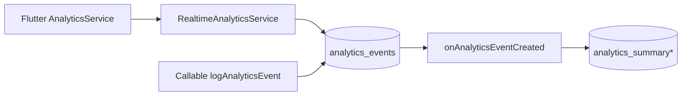

# Realtime analytics (Firestore + Cloud Functions)

This document describes the **mobile-originated** analytics pipeline added alongside the existing callable `logAnalyticsEvent` flow. Source of truth for **which events exist in the product** remains [`mobile-analytics-inventory.md`](mobile-analytics-inventory.md).

## Architecture

1. **Client** (`AnalyticsService` → `RealtimeAnalyticsService`) writes `analytics_events` with `source: mobile`, `aggregationVersion: 1`, time keys, platform, environment, etc.
2. **Cloud Function** `logAnalyticsEvent` still writes **anonymous** rows to `analytics_events` with `source: cloud_function` (and `analytics_events_private` unchanged).
3. **Aggregation trigger** `onAnalyticsEventCreated` runs on each new `analytics_events` doc and **skips** `source: cloud_function` so totals are not doubled.
4. **Summary docs** are updated only by Cloud Functions (Admin SDK). The admin webapp may **subscribe** to `analytics_summary/global` for live totals.

## Raw event schema (`analytics_events/{id}`)

| Field | Type | Notes |
| --- | --- | --- |
| `eventName` | string | e.g. `screen_view`, `community_post_created` |
| `userId` | string | Authenticated UID (mobile writes) |
| `anonUserId` | string | Stable hash from profile |
| `feature` | string | Allowlisted feature id |
| `screen` | string? | From `metadata.screen_name` when present |
| `timestamp` | server timestamp | |
| `clientTimestamp` | string (ISO) | Client clock |
| `platform` | string | `ios`, `android`, `web`, … |
| `appVersion` | string? | From `package_info_plus` |
| `environment` | string | `local` (debug) or `prod` |
| `sessionId` | string | From `AnalyticsService` |
| `metadata` | map | Sanitized lifecycle + parameters |
| `source` | string | `mobile` (aggregated) or `cloud_function` (not aggregated) |
| `aggregationVersion` | number | `1` |
| `dateKey` | string | `YYYY-MM-DD` (UTC) |
| `hourKey` | string | `YYYY-MM-DD-HH` (UTC) |
| `monthKey` | string | `YYYY-MM` |
| `cohortType`, `gestationalWeek`, `trimester` | optional | Duplicated from context where available |

Optional categorical IDs may be added later under `metadata` (postId, threadId, etc.) — **never** store message bodies or free-text health content.

## Summary collections (read in dashboard)

| Path | Purpose |
| --- | --- |
| `analytics_summary/global` | Rolling totals, first-class “today*” counters where mapped |
| `analytics_summary_daily/{dateKey}` | Per-day `countsByEventName`, `countsByFeature`, plus mapped daily fields |
| `analytics_feature_summary/{featureDocId}` | Per-feature totals and `countsByEventName` |
| `analytics_summary_hourly/{hourKey}` | Optional hourly rollups |

**Security:** see [`firestore.rules`](../firestore.rules) — clients **cannot** write summary docs; authenticated admin roles can read.

## Local testing (Emulator Suite)

1. Start emulators (example): `firebase emulators:start --only firestore,functions`
2. Flutter: pass `--dart-define=USE_FIREBASE_EMULATOR=true` so [`lib/services/firebase_service.dart`](../lib/services/firebase_service.dart) attaches the Firestore emulator (`127.0.0.1:8080`).
3. Deploy functions build to emulator or use `firebase emulators:exec` as you normally do for this repo.
4. Sign in, trigger any `AnalyticsService` event; confirm a new `analytics_events` doc with `source: mobile`, then `analytics_summary/global` increments.

**Note:** Callable `logAnalyticsEvent` from the emulator must target the **functions** emulator; if the app still points to production Functions, CF writes will hit prod — only use emulator-aligned endpoints for full isolation.

## Production

- Deploy updated **Firestore rules** and **Cloud Functions** after merging.
- No change required to existing **callable** analytics for admins beyond the new `source` field on CF-written rows.

## Implemented / mapped events

Events already flowing through `AnalyticsService.logEvent` / named helpers continue to produce mobile `analytics_events` and (for most) appear in aggregates. **New** explicit events:

- `sign_in_completed` (`authentication-onboarding`) — Google, Apple, email in [`Login_screen.dart`](../lib/auth/Login_screen.dart)
- `profile_updated` (`profile-editing`) — successful save in [`edit_profile_screen.dart`](../lib/editprofile/edit_profile_screen.dart)

First-class counters in `analytics_summary/global` include (non-exhaustive): `todayPostsCreated`, `todayJournalEntries`, `todayVisitSummaries`, `todayBirthPlansCompleted`, `todayProviderSearches`, `todaySessionsStarted`, `todayScreenViews`, `todayProfileUpdates`, `todaySignIns`, and related daily fields where applicable — see [`admindash/functions/src/analyticsAggregation.ts`](../admindash/functions/src/analyticsAggregation.ts).

## Not yet instrumented

See gaps in [`mobile-analytics-inventory.md`](mobile-analytics-inventory.md): session end, many `AnalyticsService` helpers without UI, learning module completion duration, etc.
